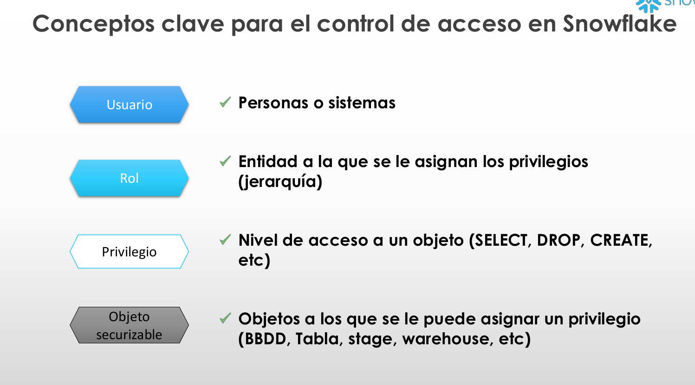
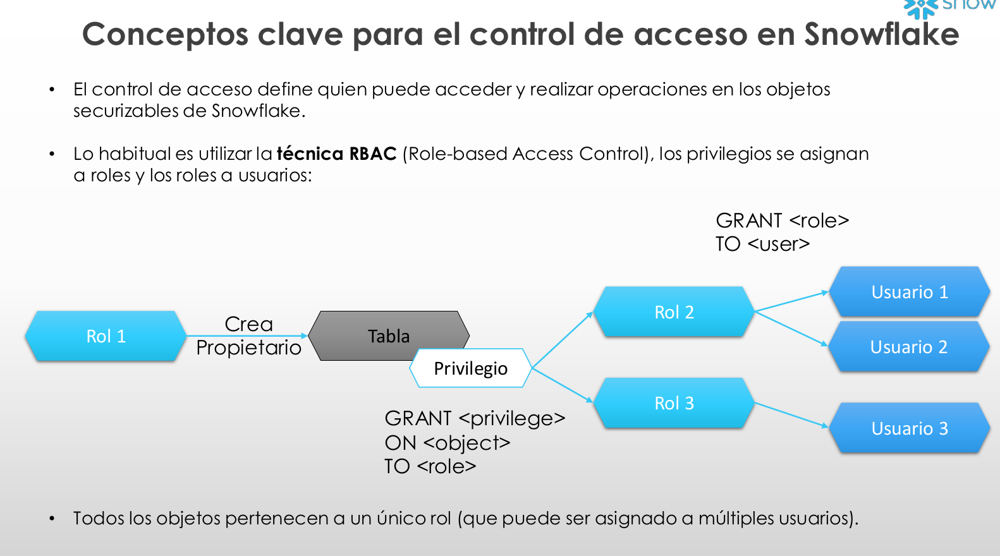
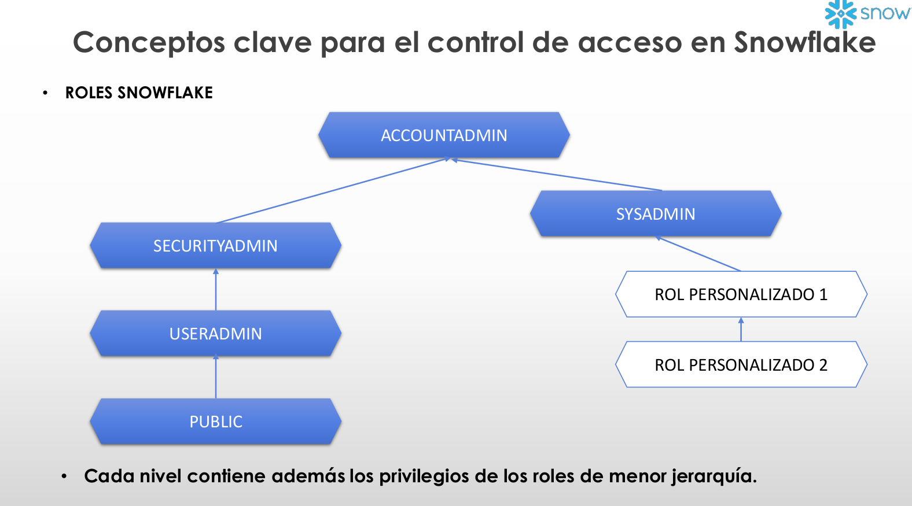
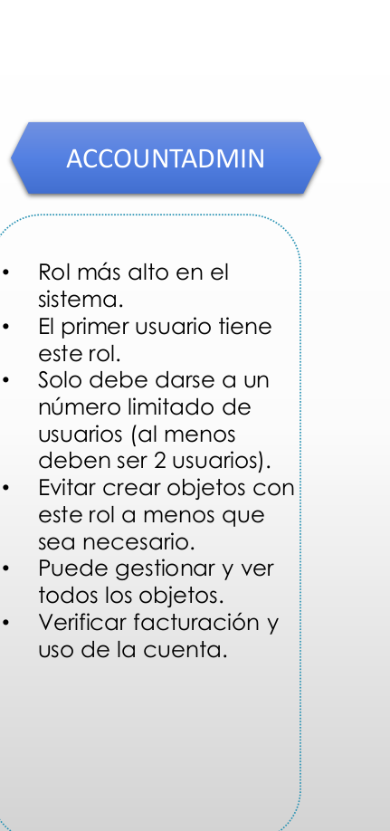
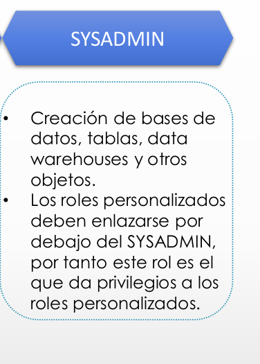
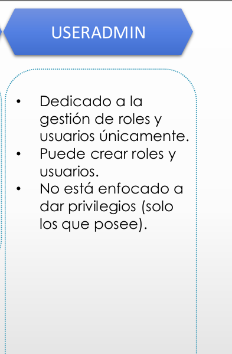

# 8-Gestion-de-accesos
1. [Intro](#schema1)
2. [Rol ACCOUNTADMIN](#schema2)
3. [Rol SECURITY ADMIN](#schema3)
4. [Rol SYS ADMIN](#schema4)
5. [Rol USER ADMIN](#schema5)
6. [Public](#schema6)

<hr>

<a name="schema1"></a>

## 1. Intro





<hr>

<a name="schema2"></a>

## 2. Rol ACCOUNTADMIN


1. Creación usuario ACCOUNTADMIN 2
```sql
CREATE USER maria PASSWORD = '123' 
DEFAULT_ROLE = ACCOUNTADMIN 
MUST_CHANGE_PASSWORD = TRUE;

GRANT ROLE ACCOUNTADMIN TO USER maria;
```

2.  Creación usuario SECURITYADMIN
```sql
CREATE USER fran PASSWORD = '123' 
DEFAULT_ROLE = SECURITYADMIN 
MUST_CHANGE_PASSWORD = TRUE;

GRANT ROLE SECURITYADMIN TO USER fran;
```

3. Creación usuario SYSADMIN
```sql
CREATE USER alberto PASSWORD = '123' 
DEFAULT_ROLE = SYSADMIN 
MUST_CHANGE_PASSWORD = TRUE;

GRANT ROLE SYSADMIN TO USER alberto;
```
<hr>

<a name="schema3"></a>

## 3. Rol SECURITY ADMIN


1. Creación y gestión de roles y usuarios
```sql
create role ventas_admin;
create role ventas_users;
```
2. Crear jerarquía
```sql
grant role ventas_users to role ventas_admin;
```
3. Asignar roles personalizados a SYSADMIN como buena práctica
```sql
grant role ventas_admin to role SYSADMIN;
```
4. Crear usuario ventas
```sql
CREATE USER diego PASSWORD = '123' DEFAULT_ROLE =  ventas_users 
MUST_CHANGE_PASSWORD = TRUE;
GRANT ROLE ventas_users TO USER diego;
``` 
5. Crear usuarios ventas administrador
```sql
CREATE USER oliver_admin PASSWORD = '123' DEFAULT_ROLE =  ventas_admin
MUST_CHANGE_PASSWORD = TRUE;
GRANT ROLE ventas_admin TO USER  oliver_admin;
```

<hr>

<a name="schema4"></a>

## 4. Rol SYS ADMIN

1. Crear Data Warehouse X-SMALL
```sql
create warehouse public_wh with
warehouse_size='X-SMALL'
auto_suspend=300 
auto_resume= true
```

2. Dar permisos al rol public
```sql
grant usage on warehouse public_wh 
to role public
```
3. Crear BBDD accesible para todos
```sql
create database common_db;
grant usage on database common_db to role public
```
4. Crear BBDD Ventas para rol administrador ventas (ventas_admin) y darles la propiedad
```sql
create database sales_database;
grant ownership on database sales_database to role ventas_admin;
grant ownership on schema sales_database.public to role ventas_admin

SHOW DATABASES;
```

<hr>

<a name="schema5"></a>

## 5. Rol USER ADMIN



1. Crear usuario
```sql
CREATE OR REPLACE USER antonio PASSWORD = '123' 
DEFAULT_ROLE = ventas_admin
MUST_CHANGE_PASSWORD = TRUE;

GRANT ROLE ventas_admin TO USER antonio;
```

<hr>

<a name="schema6"></a>

## 6. Public

0. Seleccionamos base de datos y rol
```sql
USE ROLE ventas_admin;
USE SALES_DATABASE;
```

1. Crear tabla

```sql
create or replace table customers(
  id number,
  full_name varchar, 
  email varchar,
  phone varchar,
  spent number,
  create_date DATE DEFAULT CURRENT_DATE);
```
2. Insertar valores
```sql
insert into customers (id, full_name, email,phone,spent)
values
  (1,'Lewiss MacDwyer','lmacdwyer0@un.org','262-665-9168',140),
  (2,'Ty Pettingall','tpettingall1@mayoclinic.com','734-987-7120',254),
  (3,'Marlee Spadazzi','mspadazzi2@txnews.com','867-946-3659',120),
  (4,'Heywood Tearney','htearney3@patch.com','563-853-8192',1230),
  (5,'Odilia Seti','oseti4@globo.com','730-451-8637',143),
  (6,'Meggie Washtell','mwashtell5@rediff.com','568-896-6138',600);
```

3. Consultar tabla con rol ventas_users
```sql
USE ROLE ventas_users;
SELECT* FROM CUSTOMERS;
```
Se produce un error porque no tiene permisos `ventas_users` para ver la tabla
```sql
USE ROLE PUBLIC;
SELECT* FROM CUSTOMERS;
```
Se produce un error porque no tiene permisos `PUBLIC` para ver la tabla

4. Permitir el uso de la BBDD a ventas_users y privilegio SELECT
```sql
USE ROLE ventas_admin;

GRANT USAGE ON DATABASE SALES_DATABASE TO ROLE ventas_users;
GRANT USAGE ON SCHEMA SALES_DATABASE.PUBLIC TO ROLE ventas_users;
GRANT SELECT ON TABLE SALES_DATABASE.PUBLIC.CUSTOMERS TO ROLE ventas_users
```

5. Validación privilegios
```sql
USE ROLE ventas_users;
SELECT* FROM CUSTOMERS;
DROP TABLE CUSTOMERS;
DELETE FROM CUSTOMERS;
```
Este usario `ventas_users` no tiene privilegios para borrar una tabla.

6. Permitir privilegio "DELETE" a ventas_users
```sql
USE ROLE ventas_admin;
GRANT DELETE ON TABLE SALES_DATABASE.PUBLIC.CUSTOMERS TO ROLE ventas_users
```
7. Validación privilegios
```sql
USE ROLE ventas_users;
DELETE FROM CUSTOMERS;
```